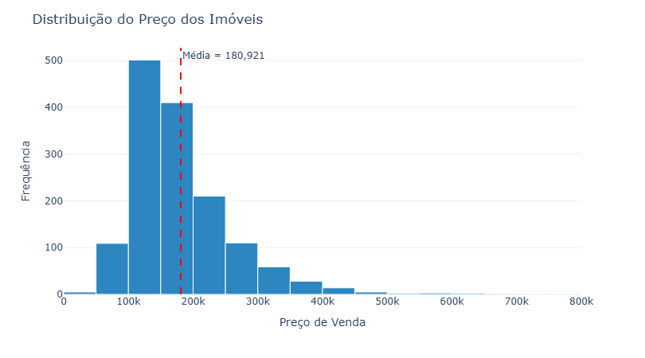
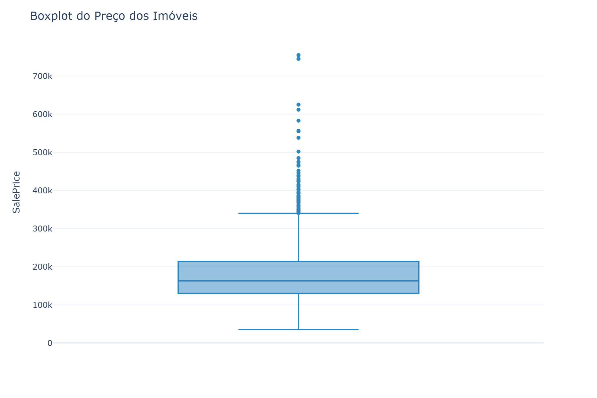
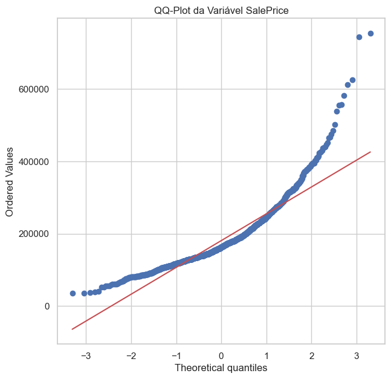
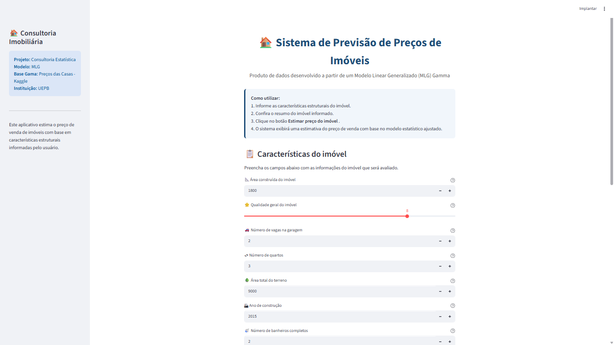

##  {.capa-slide background-image="capa_canva.png" background-size="75% auto" background-position="center" background-repeat="no-repeat"}

## Problema de Negócio

::: caixa
<h3 style="color:#0F3D66;">

Como estimar o preço de venda de um imóvel de forma objetiva?

</h3>

Uma imobiliária necessita de uma forma mais objetiva e padronizada para estimar o preço de venda dos imóveis, reduzindo a dependência de avaliações exclusivamente subjetivas.

O desafio é identificar quais características dos imóveis exercem maior influência sobre o preço e utilizar esse conhecimento para apoiar a tomada de decisão.

:::

::: {.caixa-azul style="padding:12px; margin-top:10px;"}

<b>Problema central:</b> Como estimar,de forma objetiva e confiável , o valor de mercado de imóvel a partir de suas características?

:::

## Objetivo do Projeto

::: caixa
<h3 style="color:#0F3D66;">

🎯 Objetivo Geral

</h3>

Desenvolver um modelo estatístico capaz de estimar o preço de venda de imóveis residenciais a partir de suas características estruturais, apoiando a tomada de decisão no mercado imobiliário.

:::

## Objetivos Específicos

::: caixa
<h3 style="color:#0F3D66;">

📌 Objetivos Específicos

</h3>

<ul style="font-size:0.90em; line-height:1.8;">

<li>Identificar os principais fatores associados ao preço dos imóveis.</li>

<li>Comparar Modelos Lineares Generalizados com distribuições Gaussiana e Gamma.</li>

<li>Selecionar o modelo com melhor desempenho estatístico.</li>

<li>Desenvolver um sistema interativo para estimativa de preços.</li>

</ul>
:::

## Metodologia do Projeto

:::::::: {style="display:flex; justify-content:space-between; align-items:center; margin-top:25px;"}
::: {.caixa style="width:28%; text-align:center;"}
<h3 style="font-size:2em;">

📂

</h3>

<b>Base de Dados</b>
:::

::: {style="font-size:34px; color:#0F3D66;"}
➜
:::

::: {.caixa style="width:28%; text-align:center;"}
<h3 style="font-size:2em;">

🧹

</h3>

<b>Tratamento dos Dados</b>
:::

::: {style="font-size:34px; color:#0F3D66;"}
➜
:::

::: {.caixa style="width:28%; text-align:center;"}
<h3 style="font-size:2em;">

📊

</h3>

<b>Análise Exploratória</b>
:::
::::::::

::: {style="text-align:center; font-size:42px; color:#0F3D66; margin:15px 0;"}
⬇
:::

:::::::::: {style="display:flex; justify-content:space-between; align-items:center;"}
::: {.caixa style="width:20%; text-align:center;"}
<h3 style="font-size:2em;">

⚙️

</h3>

<b>Modelagem (MLG)</b>
:::

::: {style="font-size:34px; color:#0F3D66;"}
➜
:::

::: {.caixa style="width:20%; text-align:center;"}
<h3 style="font-size:2em;">

📈

</h3>

<b>Comparação dos Modelos</b>
:::

::: {style="font-size:34px; color:#0F3D66;"}
➜
:::

::: {.caixa style="width:20%; text-align:center;"}
<h3 style="font-size:2em;">

✅

</h3>

<b>Modelo Final</b>
:::

::: {style="font-size:34px; color:#0F3D66;"}
➜
:::

::: {.caixa style="width:20%; text-align:center;"}
<h3 style="font-size:2em;">

💻

</h3>

<b>Sistema Streamlit</b>
:::
::::::::::

## Base de Dados

::::::::: {style="display:flex; gap:30px; align-items:center;"}
:::: {.caixa style="width:40%; min-height:210px;"}
<h3 style="color:#0F3D66;">

📂 House Prices

</h3>

<b>Fonte:</b> Kaggle

::: {style="height:1px; background:#D9E6F2; margin:15px 0;"}
:::

📍 <b>Local</b> Ames, Iowa (EUA)

💰 <b>Variável resposta</b> SalePrice (USD)

::::

:::::: {style="width:60%; display:flex; justify-content:space-between; align-items:stretch;"}
::: {.card style="width:30%; min-height:190px; text-align:center;"}
<h3 style="font-size:2em;">

🏠

</h3>

1.460

Imóveis

:::

::: {.card style="width:30%; min-height:190px; text-align:center;"}
<h3 style="font-size:2em;">

📊

</h3>

81

Variáveis

:::

::: {.card style="width:30%; min-height:190px; text-align:center;"}
<h3 style="font-size:2em;">

💰

</h3>

SalePrice

Variável resposta

:::
::::::
:::::::::

::: {.caixa style="margin-top:20px; padding:12px 18px;"}

A base reúne características estruturais dos imóveis utilizadas para explicar e prever o preço de venda.

:::

## Análise Exploratória dos Dados

:::::: {style="display:flex; gap:20px; justify-content:space-between; align-items:flex-start;"}
::: {style="width:32%; text-align:center;"}
<h4 style="color:#0F3D66;">

Histograma

</h4>

{width="100%"}
:::

::: {style="width:32%; text-align:center;"}
<h4 style="color:#0F3D66;">

Boxplot

</h4>

{width="100%"}
:::

::: {style="width:32%; text-align:center;"}
<h4 style="color:#0F3D66;">

QQ-Plot

</h4>

{width="100%"}
:::
::::::

## Principais Achados

::: caixa
<h3 style="color:#0F3D66;">

📌 Evidências da Análise Exploratória

</h3>

<ul style="font-size:0.85em; line-height:1.8;">

<li><b>Assimetria positiva</b> na distribuição da variável <b>SalePrice</b>.</li>

<li>Presença de <b>valores extremos (outliers)</b>.</li>

<li><b>Rejeição da hipótese de normalidade</b>, pelo teste de D'Agostino-Pearson, corroborada pelo QQ-Plot .</li>

</ul>
:::

 

::: caixa-azul
<h3 style="margin-top:0; font-size:1.05em;">

🎯 Decisão Estatística

</h3>

<b>Modelo escolhido:</b> Modelo Linear Generalizado com distribuição <b>Gamma</b>, por apresentar melhor adequação às características observadas da variável <b>SalePrice</b>.

:::

## Comparação dos Modelos

:::::: {style="display:flex; gap:30px; align-items:center;"}
::: {style="width:62%;"}
<h3 style="color:#0F3D66;">

Comparação dos Modelos Ajustados

</h3>

| Modelo    | AIC          | LogLik        | Deviance    |
|-----------|--------------|---------------|-------------|
| Gaussiano | 34968,19     | -17475,10     | 2,13 × 10¹² |
| **Gamma** | **34048,71** | **-17015,35** | **40,41**   |
:::

:::: {style="width:38%;"}
::: caixa-azul
<h3 style="margin-top:0;">

🏆 Modelo Selecionado

</h3>

<b>GLM Gamma</b>

✓ Menor AIC  ✓ Maior Log-Likelihood  ✓ Menor Deviance

:::
::::
::::::

## Decisão da Modelagem

::: {.caixa-azul style="padding:14px 18px;"}
<h3 style="margin:0; font-size:1.05em;">

🎯 Modelo Selecionado

</h3>

O <b>Modelo Linear Generalizado com distribuição Gamma</b> apresentou o melhor desempenho estatístico entre os modelos avaliados.

:::

 

::: {.caixa style="padding:14px 18px;"}
<h3 style="color:#0F3D66; margin:0 0 8px 0; font-size:1.05em;">

📌 Justificativa

</h3>

<ul style="font-size:0.80em; line-height:1.5; margin:0;">

<li>Melhor ajuste aos dados.</li>

<li>Menor valor de AIC.</li>

<li>Maior Log-Likelihood.</li>

<li>Menor Deviance.</li>

</ul>
:::

## Modelo Final

<h3 style="color:#0F3D66;">

📌 Principais variáveis associadas ao preço dos imóveis

</h3>

::::::::: {style="display:grid; grid-template-columns:1fr 1fr; gap:15px; margin-top:20px;"}
::: caixa
📐 <b>Área construída</b>  <small>(GrLivArea)</small>
:::

::: caixa
⭐ <b>Qualidade geral</b>  <small>(OverallQual)</small>
:::

::: caixa
🚗 <b>Garagem</b>  <small>(GarageCars)</small>
:::

::: caixa
🌳 <b>Área do terreno</b>  <small>(LotArea)</small>
:::

::: caixa
🏡 <b>Ano de construção</b>  <small>(YearBuilt)</small>
:::

::: caixa
🛏 <b>Quartos e banheiros</b>  <small>(BedroomAbvGr e FullBath)</small>
:::
:::::::::

## Interpretação do Modelo

::: caixa
<h3 style="color:#0F3D66;">

📌 Principais Resultados

</h3>

As variáveis selecionadas pelo modelo representam as principais características estruturais que influenciam o preço de venda dos imóveis.

De forma geral, imóveis maiores, com melhor qualidade construtiva, maior capacidade de garagem, terrenos mais amplos e construções mais recentes tendem a apresentar preços de venda mais elevados.

:::

## Produto Desenvolvido

:::::: {style="display:flex; gap:25px; align-items:center;"}
:::: {style="width:33%;"}
::: {.caixa style="padding:14px 16px;"}
<h3 style="color:#0F3D66; margin-top:0; font-size:1.05em;">

💻 Produto de Dados

</h3>

Foi desenvolvido um sistema em <b>Streamlit</b> para estimar automaticamente o preço de venda de imóveis a partir das características informadas pelo usuário.

:::
::::

::: {style="width:67%;"}
{width="100%"}
:::
::::::

## Conclusões

::: caixa
<ul style="font-size:0.88em; line-height:2;">

<li>✔ <b>GLM Gamma</b> apresentou o melhor desempenho estatístico.</li>

<li>✔ As características estruturais são determinantes para o preço dos imóveis.</li>

<li>✔ Desenvolvimento de um sistema interativo em <b>Streamlit</b>.</li>

<li>✔ Modelo estatístico transformado em uma ferramenta de apoio à decisão.</li>

</ul>
:::

## Agradecimentos

:::: {style="text-align:center; margin-top:20px;"}

🏠📊

<h1 style="color:#0F3D66; font-size:2.2em; border:none; margin-bottom:10px;">

Muito obrigado!

</h1>

Projeto de Consultoria Estatística

::: {style="display:inline-block; background:#4A90E2; color:white; padding:12px 38px; border-radius:25px; font-size:1.05em; font-weight:bold; margin:18px 0;"}
❓ Perguntas?
:::

<b>Eduarda da Silva Brito</b> • Maria Helena • Ana Maria

Universidade Estadual da Paraíba – UEPB

::::
